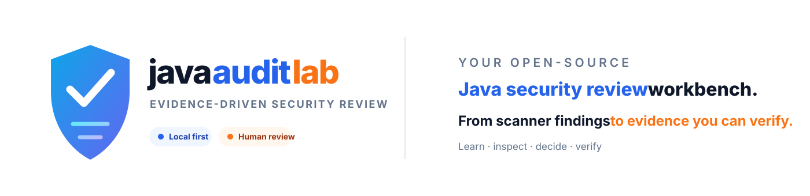

<div align="center">



[简体中文](#java-audit-lab) · [English](#english-summary)

[](https://github.com/Zuimeng-0710/java-audit-lab/releases)
[](https://github.com/Zuimeng-0710/java-audit-lab/actions)
[](https://www.python.org/)
[](LICENSE)

[](#capabilities)
[](#quick-start)

[快速开始](#quick-start) · [核心能力](#capabilities) · [证据模型](#evidence-model) · [扫描器](#scanners) · [参与开发](#development)

</div>

# Java Audit Lab

Java Audit Lab 是面向 Java 学习者、开发者和安全审计人员的开源代码审计工作台。它把扫描命中整理成可复核的证据链，帮助你理解“为什么可疑、还缺什么证据、如何人工验证”。

> [!IMPORTANT]
> 扫描结果是待人工复核的安全线索，不等于已确认漏洞。请只分析自己拥有或已获得明确授权的项目与环境。

## 为什么使用 Java Audit Lab

普通扫描器擅长找到模式，但学习者和审计人员仍要回答：输入从哪里来、经过哪些代码、是否存在净化、接口需要什么权限，以及什么证据能推翻漏洞假设。

| 传统扫描输出 | Java Audit Lab |
|---|---|
| 一条规则命中 | 入口、来源、传播、终点、净化反证与权限证据 |
| 命中即风险 | 明确区分已证明、推测、缺失和无法解析的路径 |
| 只看本次结果 | 基线对比、Git 增量审计与修复复测 |
| 报告阅读结束 | 保存人工结论、依据与信心，形成复核档案 |
| 工具各说各话 | 归并 Semgrep、SpotBugs、Dependency-Check、CodeQL 与 SARIF |

<a id="quick-start"></a>

## ⚡ 快速开始

需要 Python 3.10 或更新版本。基础扫描、报告和语料评测没有第三方 Python 依赖。

### 从源码安装

```bash
git clone https://github.com/Zuimeng-0710/java-audit-lab.git
cd java-audit-lab
python -m pip install -e .
```

### 从 Release wheel 安装

从 [Releases](https://github.com/Zuimeng-0710/java-audit-lab/releases) 下载 wheel 后执行：

```bash
python -m pip install java_audit_lab-1.8.0-py3-none-any.whl
```

### 第一次扫描

```bash
java-audit doctor
java-audit scan /path/to/java-project -o audit-report --yes
```

Windows PowerShell 示例：

```powershell
java-audit scan "D:\projects\demo" -o audit-report --yes
Start-Process audit-report\report.html
```

| 文件 | 用途 |
|---|---|
| `report.html` | 离线互动复核工作台：筛选、证据链、五问和人工结论 |
| `report.json` | 完整证据模型，可用于基线、自动化和二次开发 |
| `report.sarif` | SARIF 2.1，可接入代码托管平台和其他安全工具 |
| `report.md` | 便于粘贴到工单、审计文档和 Pull Request |

## 🧭 审计工作流

```text
项目画像 → 入口与信任边界 → Source / Sink 建模 → 数据流扫描
        → 成立条件验证 → 同类模式泛化 → 反证与绕过检查
        → 人工结论 → 修复复测与报告
```

每个阶段展示完成状态、已有证据和仍缺少的证据。阶段只由扫描结果或人工回答推进，不接受 AI 的自我声明。

### 漏洞成立五问

1. 外部入口和 HTTP 路径是什么？
2. 调用需要什么身份、角色或数据归属？
3. 输入如何到达危险操作？
4. 已经确认了哪些净化、白名单或安全控制？
5. 哪些条件仍然缺少证据？

<a id="capabilities"></a>

## ✨ 核心能力

| 能力 | 当前实现 |
|---|---|
| 教学规则 | 12 类零依赖 Java 规则，覆盖 SQL、命令、路径、XXE、反序列化、SSRF、表达式、弱哈希、认证与敏感日志 |
| 方法内污点 | 数据驱动 Source、Sink、Sanitizer 模型，追踪请求参数、赋值和净化反证 |
| 配置凭据 | 扫描 YAML、Properties、JSON、`.env` 等配置；证据和指纹不保存原始值 |
| 攻击面画像 | Controller、Filter、Interceptor、Security、上传、消息消费者、定时任务、MyBatis 与 JPA |
| 权限矩阵 | Spring Security、Shiro、方法级注解和 Spring MVC 自定义拦截器 |
| 增量审计 | 变更文件、依赖闭包、权限放宽、同类新位置和修复残留 |
| 多引擎证据 | 归并 SARIF、Semgrep、SpotBugs、Dependency-Check 和 CodeQL 结果 |
| 复核档案 | 浏览器本地保存、导出、重新导入、基线新增与已修复分类 |
| 匿名语料 | vulnerable / safe / edge 标准答案、严格行号和防“假绿”评测 |

每条发现会区分 `production`、`test`、`example` 和 `generated` 范围，避免测试与示例代码稀释生产风险。

<a id="evidence-model"></a>

## 🔎 证据模型

Java Audit Lab 不虚构完整调用链。每条发现都保存统一证据记录：

```json
{
  "entry": {"covered": true, "note": "位置位于已识别入口文件"},
  "source": {"path": "src/main/java/lab/Demo.java", "line": 10},
  "propagation": [{"path": "...", "line": 11, "label": "可能的赋值传播"}],
  "sanitizers": [{"origin": "control", "detail": "发现白名单信号"}],
  "sink": {"path": "src/main/java/lab/Demo.java", "line": 12},
  "authorization": {"status": "权限推测"},
  "unresolved_steps": [],
  "engine_evidence": [{"scanner": "builtin", "rule_id": "JAL-SQL-001"}]
}
```

| 路径等级 | 含义 |
|---|---|
| **已证明** | CodeQL 或 SARIF `codeFlows` 提供的扫描器级数据流 |
| **推测** | 内置规则或方法内文本分析形成的保守候选 |
| **缺失** | 没有足够路径证据，工具不会自动补写 |
| **无法解析** | 反射、动态分派或其他动态调用位于唯一候选路径上 |

## 🔐 端点权限矩阵

报告按“接口 × 方法 × 身份要求 × 角色/权限 × 危险操作 × 证据状态”展示访问控制：

| 证据来源 | 状态 |
|---|---|
| `@PreAuthorize`、`@Secured`、`@RolesAllowed`、Shiro 注解 | 已证明 |
| `SecurityFilterChain` matcher、Shiro filter chain | 已证明（配置级） |
| 已验证令牌读取、校验和拒绝路径的 MVC Interceptor | 已证明 |
| 仅根据鉴权语义名称识别的 Interceptor | 推测 |
| 无匹配声明 | 缺失，需要人工确认 |

明确公开的接口可以在 `.java-audit.yml` 中声明：

```yaml
public_endpoints:
  - /login
  - /health
```

<a id="scanners"></a>

## 🧰 扫描器

未安装的外部扫描器不会阻止其他扫描器和报告生成。

| 扫描器 | 输入条件 | 作用 |
|---|---|---|
| `builtin` | Java 源码 | 可解释教学规则与局部路径候选 |
| `secrets` | YAML、Properties、JSON、`.env` 等 | 查找字面量凭据并全程脱敏 |
| `taint` | Java 源码 | 方法内输入、赋值、净化与危险终点传播 |
| Semgrep | 安装 `semgrep` | 运行随包发布的本地 Java 规则 |
| SpotBugs | 安装 CLI，项目已有 class/JAR | 字节码缺陷；建议配合 Find Security Bugs |
| Dependency-Check | 安装 CLI | 已公开的第三方依赖漏洞 |
| CodeQL | 安装 CLI | 跨文件数据流与安全扩展查询 |

```bash
java-audit scan . -o report \
  --scanners builtin,secrets,taint,semgrep,spotbugs,dependency-check,codeql \
  --yes
```

已有报告可以直接导入：

```bash
java-audit scan . -o report --scanners builtin \
  --sarif codeql.sarif \
  --spotbugs-xml target/spotbugsXml.xml \
  --dependency-check-json dependency-check-report.json \
  --yes
```

## 🌿 Git 增量审计

```bash
java-audit scan . -o report --diff
java-audit scan . -o report --diff main
java-audit scan . -o report --commit HEAD~1
java-audit scan . -o report --commit HEAD --baseline old-report/report.json
```

增量报告会回答：哪些发现位于变更行、权限是否被删除或放宽、修复后是否仍有同规则残留，以及哪些上下文可能受到影响。

<a id="project-config"></a>

## ⚙️ 项目配置

复制 `.java-audit.example.yml` 为待审计项目根目录下的 `.java-audit.yml`：

```yaml
scanners: [builtin, secrets, taint, semgrep, spotbugs, dependency-check, codeql]
public_endpoints: [/login, /health]
fail_on: high
ai_level: beginner
cache: true
exclude_paths: [src/test/*, generated/*]
extra_rules: [.java-audit/rules/team-rules.yaml]
```

命令行参数覆盖配置文件。使用 `--no-cache` 可强制重新扫描，`--exclude "glob"` 可临时排除目录。

### 基线与人工复核

```bash
java-audit scan . -o report-next --baseline report/report.json
java-audit scan . -o report-next --review-file review.json
java-audit scan . -o report-ci --baseline old-report.json --fail-on high --yes
```

报告搜索支持组合条件：`cwe:89 path:controller scanner:codeql priority:70`。

## 🤖 可选 AI 解释

AI 只接收单条发现的脱敏证据，用于生成学习解释，不能把发现升级为“已确认漏洞”。接口兼容 `/chat/completions`：

```powershell
$env:JAVA_AUDIT_AI_ENDPOINT="http://localhost:11434/v1"
$env:JAVA_AUDIT_AI_MODEL="your-model"
$env:JAVA_AUDIT_AI_KEY=""
java-audit scan . -o report --scanners builtin --ai --ai-level beginner --yes
```

解释层级：`beginner`、`intermediate`、`advanced`。

## 🧪 匿名评测语料

`corpus/` 当前包含 SQL 注入、SSRF、路径遍历和硬编码凭据的 vulnerable、safe、edge 试点案例：

```bash
python corpus/tools/validate_corpus.py
python corpus/tools/evaluate_corpus.py --strict-locations
```

匿名校验不会回显命中的敏感内容。train 样本上的高分只证明评测流水线和当前回归成立，不代表真实项目准确率。详见 [corpus/README.md](corpus/README.md)。

<a id="development"></a>

## 🧑‍💻 参与开发

```bash
python -m unittest discover -s tests -v
python -m audit benchmark
python corpus/tools/validate_corpus.py
python corpus/tools/evaluate_corpus.py --strict-locations
python -m compileall -q audit
```

规则贡献需要同时提供危险示例、安全示例、容易误报的边界示例和复核条件。参见 [CONTRIBUTING.md](CONTRIBUTING.md)。安全问题请按 [SECURITY.md](SECURITY.md) 私密报告。

### 项目结构

```text
java-audit-lab/
├─ audit/              # CLI、证据模型、报告和扫描器适配器
├─ corpus/             # 匿名语料、标准答案、校验器和评测器
├─ rules/              # 可扩展规则与 Semgrep 规则
├─ examples/           # 安全、不安全、权限与增量示例
├─ tests/              # 解析器、规则、报告、权限和语料回归
├─ docs/               # 设计与研究文档
└─ .github/workflows/  # CI
```

## 已知边界

- `builtin` 与 `taint` 当前不提供完整的跨方法、跨模块数据流证明；Controller → Service → Mapper 等链路建议结合 CodeQL。
- 入口与权限解析基于常见框架模型；未命中代表证据缺失，不代表接口一定没有控制。
- 反射、动态分派、运行时配置和生成源码可能降低静态分析覆盖率。
- SpotBugs 需要先构建项目；Dependency-Check 首次更新漏洞数据库可能需要网络和较长时间。
- AI 解释可能错误，人工结论应始终回到原始代码和扫描证据。
- 内置基准和 train 语料用于回归，不应当作为真实世界准确率声明。

完整变化见 [CHANGELOG.md](CHANGELOG.md)。

<a id="english-summary"></a>

## English summary

Java Audit Lab is an open-source, evidence-driven Java security review workbench for learners, developers, and security auditors. It turns scanner findings into reviewable evidence covering entry points, sources, propagation, sinks, sanitizers, authorization, uncertainty, and remediation verification.

Scan results are review candidates rather than confirmed vulnerabilities. Review only projects and environments you own or are explicitly authorized to assess.

## License

Java Audit Lab 使用 [MIT License](LICENSE)。Semgrep、SpotBugs、Find Security Bugs、OWASP Dependency-Check 和 CodeQL 是独立项目，使用时需遵守各自许可证与条款。
