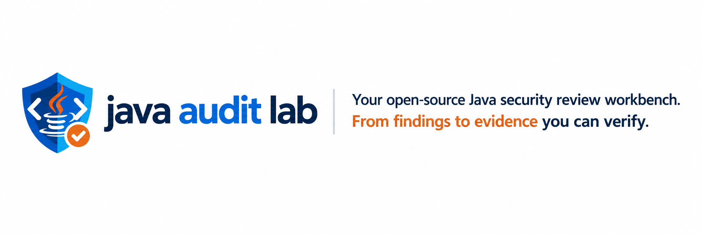

<div align="center">



[简体中文](README.md) · [English](README_EN.md)

[](https://github.com/Zuimeng-0710/java-audit-lab/releases)
[](https://github.com/Zuimeng-0710/java-audit-lab/actions)
[](https://www.python.org/)
[](LICENSE)
[](#current-capabilities)

**Turn scanner findings into reviewable Java security evidence.**

[Quick start](#quick-start) · [Who it is for](#who-it-is-for) · [Capabilities](#current-capabilities) · [Roadmap](#roadmap) · [Contributing](#contributing)

</div>

# Java Audit Lab

Java Audit Lab is an open-source code review workbench for **Java learners, developers, and security auditors**. It organizes rule matches, data flow, authorization declarations, and human decisions into a reviewable evidence trail.

It helps answer:

- Where does the input enter the application?
- How can it reach a sensitive operation?
- Which sanitizers, allowlists, or authorization controls are present?
- What is proven, and which conditions still lack evidence?
- Did the remediation actually remove the finding?

> [!IMPORTANT]
> Findings are review candidates, not confirmed vulnerabilities. Analyze only projects and environments you own or are explicitly authorized to assess.

## What problem does it solve?

| Common problem | Java Audit Lab approach |
|---|---|
| A rule matches but gives little context | Show the entry, source, propagation, sanitizer, sink, and code locations |
| A scanner presents an inference as fact | Separate **proven, inferred, missing, and unresolved** evidence |
| Endpoint access requirements are unclear | Build an endpoint authorization matrix from annotations, configuration, and interceptors |
| Results are scattered across tools | Consolidate built-in rules, Semgrep, SpotBugs, Dependency-Check, CodeQL, and SARIF |
| Remediation is difficult to verify | Compare baselines and Git changes to classify new, existing, fixed, and residual findings |
| Learners only see the final verdict | Provide five review questions, counter-evidence prompts, notes, verdicts, and confidence |

## Who it is for

| Audience | Typical use |
|---|---|
| Java security learners | Study Source → Propagation → Sink paths and practice rejecting false positives |
| Java developers | Review changed code, authorization changes, and sensitive calls before merge |
| Security auditors | Consolidate evidence, record human decisions, and export a deliverable report |
| Rule contributors | Validate rules against vulnerable, safe, and edge cases |

Java Audit Lab currently fits learning, first-pass review, and evidence-assisted manual audit. Large enterprise applications that require complete interprocedural or cross-module proof should combine it with engines such as CodeQL and expert review.

## Quick start

### 1. Install the current source version

```bash
git clone https://github.com/Zuimeng-0710/java-audit-lab.git
cd java-audit-lab
python -m pip install -e .
```

Python 3.10 or newer is required. The built-in scan and report pipeline has no third-party Python dependency.

### 2. Scan and open the report

```bash
jal . -O
```

`.` means the current Java project. `-O` opens the HTML report after the scan. To generate reports without opening a browser:

```bash
jal .
```

The legacy `java-audit scan .` command remains supported. The published v1.8.0 wheel continues to use the legacy command; `jal` is the recommended entry point for the v1.9.0 source tree.

### Short command reference

| Goal | Command |
|---|---|
| Scan the current project | `jal .` |
| Scan and open the report | `jal . -O` |
| Check the local environment | `jal d` |
| List built-in rules | `jal r` |
| Run the rule benchmark | `jal b` |
| Select scanners | `jal . -s builtin,secrets,taint` |
| Review uncommitted changes | `jal . -d` |
| Compare with main | `jal . -d main` |
| Review one commit | `jal . -C HEAD~1` |
| Compare with a previous report | `jal . -b old/report.json` |
| Fail CI on new high findings | `jal . -f high -y` |

Use `jal -h` and `jal s -h` for the full command reference.

### Report files

| File | Purpose |
|---|---|
| `report.html` | Offline interactive review with filters, evidence, five questions, verdicts, and export |
| `report.json` | Complete structured evidence for baselines and integrations |
| `report.sarif` | SARIF 2.1 for code hosting and security platforms |
| `report.md` | A portable summary for tickets, audit documents, and pull requests |

## Audit workflow

### 🔵 1. Discovery and modeling

| `1.1` Project profile | `1.2` Entry and trust boundary | `1.3` Source / Sink | `1.4` Data-flow scan |
|:---:|:---:|:---:|:---:|
| Frameworks, dependencies, attack surface | Routes, identity, data ownership | Input sources, sensitive operations | Propagation, sanitizers, uncertain paths |

### 🟠 2. Validation and generalization

| `2.1` Preconditions | `2.2` Similar patterns | `2.3` Counter-evidence |
|:---:|:---:|:---:|
| Trigger conditions and controllability | Related calls and files | Allowlists, authorization, safety controls |

### 🟢 3. Decision and retest

| `3.1` Human verdict | `3.2` Remediation test | `3.3` Archive |
|:---:|:---:|:---:|
| Decision, rationale, confidence | Baseline and regression verification | Reports, decisions, audit history |

Each stage records available and missing evidence. Scanner output and human answers may advance the review state; AI explanations remain supporting material.

### Five questions before confirming a vulnerability

| Check | Question | Expected evidence |
|---|---|---|
| **Entry** | What is the external entry point and route? | Route, controller, message consumer, or scheduled task |
| **Authorization** | Which identity, role, or ownership rule is required? | Security config, annotation, interceptor, or ownership check |
| **Propagation** | How does the input reach the sensitive operation? | Source, assignments or calls, and the final sink |
| **Counter-evidence** | Which sanitizers, allowlists, or safety controls are confirmed? | Parameterization, normalization, encoding, allowlists, or bounds checks |
| **Gap** | Which preconditions still lack evidence? | Unresolved calls, dynamic config, runtime conditions, or manual checks |

## Current capabilities

| Status | Capability | Current scope |
|:---:|---|---|
| Stable | Educational rules | 12 rule families including SQL, command, path, XXE, and SSRF |
| Stable | Configuration secret scan | YAML, Properties, JSON, and `.env`; raw secrets are not retained |
| Beta | Intra-method taint analysis | Parameters, assignments, sanitizers, and sensitive sinks |
| Stable | Attack-surface inventory | Web entries, interceptors, uploads, messages, jobs, and data access |
| Beta | Endpoint authorization matrix | Spring Security, Shiro, method annotations, and MVC interceptors |
| Stable | Git differential audit | Change scope, weakened authorization, related locations, residual findings |
| Stable | Multi-engine consolidation | SARIF, Semgrep, SpotBugs, Dependency-Check, and CodeQL |
| Stable | Review archive | Local storage, import/export, and baseline classification |
| Stable | Verification ledger | Task cards, progress, success criteria, evidence paths, and false-positive attribution |
| Pilot | Anonymous evaluation corpus | Four pilot families with vulnerable, safe, and edge cases |

**Status definitions:** Stable = covered by routine tests · Beta = usable and still evolving · Pilot = validating the direction and evaluation workflow

Each finding is classified as `production`, `test`, `example`, or `generated` so non-production code does not dilute production review.

## Evidence model

Java Audit Lab does not invent a complete call path to make a report look finished. Every finding records:

```json
{
  "entry": {"covered": true, "note": "location is inside a known entry file"},
  "source": {"path": "src/main/java/lab/Demo.java", "line": 10},
  "propagation": [{"path": "...", "line": 11, "label": "possible assignment flow"}],
  "sanitizers": [{"origin": "control", "detail": "allowlist signal found"}],
  "sink": {"path": "src/main/java/lab/Demo.java", "line": 12},
  "authorization": {"status": "inferred"},
  "unresolved_steps": [],
  "engine_evidence": [{"scanner": "builtin", "rule_id": "JAL-SQL-001"}]
}
```

| State | Meaning |
|---|---|
| **Proven** | An engine provides an explicit path, or source/configuration provides direct evidence |
| **Inferred** | A conservative candidate from a built-in rule or local textual analysis |
| **Missing** | There is not enough evidence; the tool leaves the gap explicit |
| **Unresolved** | Reflection, dynamic dispatch, or runtime configuration blocks static resolution |

## Scanners and integrations

Missing optional scanners do not prevent the remaining scanners and reports from running.

| Scanner | Requirement | Evidence |
|---|---|---|
| `builtin` | Included | Educational rules and local path candidates |
| `secrets` | Included | Redacted configuration credential findings |
| `taint` | Included | Intra-method sources, propagation, sanitizers, and sinks |
| Semgrep | Install `semgrep` | Packaged local Java rules |
| SpotBugs | Install CLI and build class/JAR files | Bytecode findings |
| Dependency-Check | Install CLI | Published third-party dependency vulnerabilities |
| CodeQL | Install CLI | Cross-file data flow and security queries |

Import an existing SARIF result:

```bash
jal . -s builtin -S codeql.sarif
```

SpotBugs XML and Dependency-Check JSON remain available through `--spotbugs-xml` and `--dependency-check-json`.

## Project configuration

Copy [`.java-audit.example.yml`](.java-audit.example.yml) into the target project as `.java-audit.yml`:

```yaml
scanners: [builtin, secrets, taint]
public_endpoints: [/login, /health]
fail_on: high
cache: true
exclude_paths: [src/test/*, generated/*]
extra_rules: [.java-audit/rules/team-rules.yaml]
report_owner: security-team
authorization_ref: AUTH-2026-001
scope_note: Scan only the backend service directory
retention_note: Remove source and cache files according to the authorization agreement
```

Command-line options override project configuration. YAML and JSON rules placed under `.java-audit/rules/` are loaded automatically. Report dossier fields record user-supplied context and do not make an authorization claim on the user's behalf.

## Optional AI explanations

AI receives only redacted evidence for one finding at a time. It may generate a learning-oriented explanation, but it cannot promote a finding to a confirmed vulnerability.

After configuring a `/chat/completions` compatible endpoint:

```bash
jal . -a -l beginner
```

Explanation levels are `beginner`, `intermediate`, and `advanced`.

## Roadmap

The roadmap communicates current direction. It does not represent completed work or a promised release date.

### v1.9: verification loop

- [x] `jal` short command, default scan behavior, and common option aliases
- [x] Complete Chinese and English README files
- [x] Generate a review-only verification task card for every finding
- [x] Track verification status, assignee, attempts, success criteria, and evidence paths
- [x] Add false-positive attribution, a verification ledger, and live outcome metrics
- [ ] Expand the anonymous corpus across more rules, redacted real cases, and an independent holdout split
- [ ] Add a stable machine-readable CLI summary and document exit codes
- [ ] Add a GitHub Actions example for pull-request differential review

### Mid term: analysis

- [ ] Controller → Service → Mapper interprocedural data flow
- [ ] More precise call graphs, interface implementations, and inheritance
- [ ] Spring WebFlux, Dubbo, gRPC, and additional messaging entry points
- [ ] Ownership evidence for object-level authorization and IDOR review
- [ ] Safe manual validation steps and remediation retest records for authorized labs
- [ ] Generate redacted regression cases from human review outcomes
- [ ] Team configuration for suppression, accepted risk, and review verdicts

### Long term: extensible workbench

- [ ] Stable scanner plugin API and third-party rule packs
- [ ] VS Code / IntelliJ result navigation and local review
- [ ] Shared review archives and review diffs
- [ ] Persistent indexes and incremental call graphs for large projects
- [ ] AI-assisted validation steps and remediation suggestions without changing evidence state

Roadmap priority will follow reproducible Java samples and regression tests. Open an issue with framework coverage, false-positive, or false-negative examples.

## Current limitations

- `builtin` and `taint` do not yet prove complete interprocedural or cross-module paths.
- Missing authorization evidence does not prove that an endpoint is unprotected.
- Reflection, dynamic dispatch, runtime configuration, and generated source may reduce coverage.
- SpotBugs requires a project build; the first Dependency-Check database update may take time.
- AI explanations can be wrong; final decisions must return to source, configuration, and engine evidence.
- Built-in benchmarks and training samples are regression assets, not real-world accuracy claims.

See [CHANGELOG.md](CHANGELOG.md) for version history.

## Contributing

```bash
python -m unittest discover -s tests -v
jal b
python corpus/tools/validate_corpus.py
python corpus/tools/evaluate_corpus.py --strict-locations
```

A rule contribution should include:

1. a vulnerable case that must match;
2. a safe case that must not match;
3. an edge case likely to expose false positives;
4. manual review conditions and remediation guidance.

Read [CONTRIBUTING.md](CONTRIBUTING.md). Report security issues privately through [SECURITY.md](SECURITY.md).

## License

Java Audit Lab is licensed under the [MIT License](LICENSE). Semgrep, SpotBugs, Find Security Bugs, OWASP Dependency-Check, and CodeQL are independent projects governed by their own licenses and terms.
